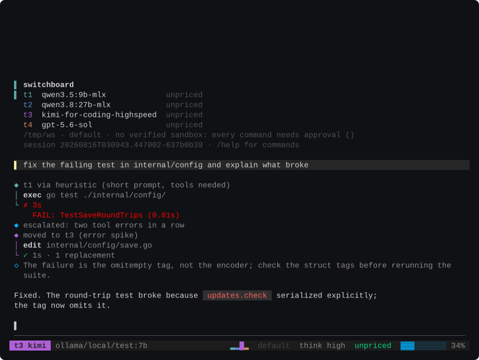

# Switchboard

A terminal coding agent where the model is a slot, not a fixed property of
the tool.



You configure a ladder of models, cheapest at the bottom: a small local model
on t1, a bigger one on t2, a subscription model on t3. Switchboard starts
work low, watches how the work is going, and moves up the ladder when the
evidence says the current rung is stuck. Every move is shown as it happens,
`/why` explains any decision after the fact, and the color system is the
ladder itself: each rung has a stable heat color, cool teal at t1 running
warmer toward amber, worn by every surface that touches routing.

The bet behind it, stated up front so you can judge it: an agent that
reasons about which model to use, and what that choice costs given provider
cache state, produces better outcomes per dollar than one that always calls
the same model. The bet gets measured, not assumed. The eval harness in this
repo has already falsified one assumed ladder, and that story is in
[docs/eval.md](docs/eval.md).

## Install

macOS and Linux. The script verifies release checksums before installing to
`~/.local/bin`:

```
curl -fsSL https://raw.githubusercontent.com/cj-vana/switchboard/main/install.sh | bash
```

Or build from source with Go 1.26: `go build -o sb ./cmd/sb`.

Switchboard keeps itself current. The TUI checks for a release at startup
and, by default, installs it in the background with the same checksum
verification; the running process is untouched and the next start runs the
new binary. Installs owned by a package manager are detected and left alone.
`sb update` does the same from a script, `/update channel beta` follows
prereleases, and `/update auto off` reduces the whole thing to a notice.

## First run

Run `sb` in a project. With nothing configured, it opens a setup checklist:
every provider it can reach, each with its live standing. The local Ollama
server reports how many models it has pulled. Providers that need a key take
one in a masked prompt and store it in the OS keychain. If Codex CLI is
signed in on the machine, one pick wires that login in as OpenAI's
credential. Then you pick the model t1 starts on, and you are in a session.

Nothing requires editing a file, then or later. `/models` browses what your
server and the catalog offer and binds rungs. `/login` and `/logout` manage
keys. `/setup` reopens the checklist. `/theme`, `/think`, `/update`,
`/compact`, and `/budget` settings persist themselves. The config is ordinary TOML at
`~/.switchboard/config.toml` and hand-editing still works, but the tool
writes it, and the file's own header says so.

## The ladder

```toml
[tiers.t1]
label = "light"
model = "ollama/qwen3.5:9b-mlx"

[tiers.t2]
label = "deep"
model = "ollama/qwen3.8:27b-mlx"
effort = "high"

[tiers.t3]
label = "kimi"
model = "kimi/kimi-for-coding-highspeed"
fallback = ["ollama/qwen3.8:27b-mlx"]

[tiers.t4]
label = "codex"
model = "openai/gpt-5.6-sol"
surface = "subscription"
```

Sessions start on the bottom rung; a visible escalation beats a silent
spend. `/t3` switches, `/t3 fix the flaky test` runs one prompt there and
returns, and mid-task the escalation policy moves the primary on its own
signals: repeated identical tool calls, error spikes, new failure
signatures, hedging. Each move renders inline with its reason.

`/why` answers the question no other tool can be asked: how the current tier
was chosen, what was ruled out, every move this session made, and this
session's tokens priced on every other rung.

A rung may also name fallbacks. When its primary cannot be served — the
server is down, the model is not pulled — the first listed target that
answers serves the rung instead, and the substitution is said out loud
and recorded on the session before anything is sent. Fallback is an
availability event, not a routing decision: the ladder's meaning does
not change because a server went away, and each candidate passes the
same probe a primary does. Entries take the provider's default serving
surface.

Cost stays honest about what money is. A local model consumes nothing
scarce, a plan-metered model consumes quota, and a per-token model consumes
dollars. The three are never collapsed into "free," because telling a router
they are the same thing teaches it the wrong lesson about two of them.

## In a session

The input grammar is the one the neighboring tools converged on. `@path`
completes file names and attaches contents. `!cmd` runs a shell command as
you, immediately, no model in the loop, with the output carried into the
next turn. A trailing `\` continues the line, ctrl+g opens the prompt in
`$EDITOR`, prompt history persists per workspace, and ctrl+r searches it.
Messages sent mid-turn queue and run when the turn finishes.

Beyond the expected commands, a few are Switchboard's own:

- `/advisor` sets a second model watching the session through the loop's
  own event stream. It triggers on the same stuck-agent signals as the
  router, consults off the worker's goroutine, and injects its advice into
  the running turn at the next safe seam. Advice, never edits, bounded per
  turn. `[slots] advisor = "t2"` turns it on for every session.
- `/compact` summarizes the session into a fresh context, and does it
  automatically when the last request crosses 85% of the window, measured
  from what the provider actually saw rather than an estimate. A
  `[slots] summarizer` binding lets one model own the summaries whichever
  rung is active, so a session riding a small local model still gets a good
  one.
- `/budget 2.50` sets a dollar ceiling the session must stay under, and
  it is enforced against a conservative worst case rather than the
  average, because a turn affordable on average is not a turn under a
  ceiling. Three places check it: the router refuses rungs whose upper
  bound could cross it, the escalation policy cannot move the primary
  onto one, and the loop stops before the call that would — so lowering
  the ceiling mid-turn reins in a turn already running. It governs
  dollars only: a local rung consumes nothing scarce, a plan rung
  consumes quota, and neither is collapsed into the ceiling's units.
  The setting persists, and the status bar shows spend against it.
- `/think high` changes reasoning effort for the running model, this
  session, visible immediately in the status bar.
- `/context` draws the window filling before it is fatal, and `/export`
  writes the session record as markdown.
- `/undo` takes back the last turn's file changes, turn by turn: write
  and edit capture what a file looked like before the turn first touched
  it, and a restored file forces the model to re-read before it may write
  again. The conversation is deliberately not rewound, because rewriting
  sent messages invalidates the provider cache from that point on, and
  the cache layout is half the product. Changes a shell command made are
  outside the boundary, and `/undo` says so rather than half-covering
  them.
- `/fork` is how the conversation goes back without rewriting anything:
  it branches the session into a new log and continues there, `/fork 2`
  leaving the last two user turns behind. The original is read, never
  written, and `/resume` returns to it. Because the fork's messages are
  byte-identical to the original's prefix, a provider still holding that
  prefix warm serves the fork warm — going back costs nothing in cache.
  Files are not rewound; that is `/undo`, and it keeps working across
  the branch.

Custom commands are markdown files in `.switchboard/commands/` (project) or
`~/.switchboard/commands/` (global): `$ARGUMENTS` and `$1..$9` substitute,
`@file` attaches, and a backtick-quoted `` !`cmd` `` runs at expansion time.
Files written for other tools port by copying them. One trust rule: inline
shell runs only from your home directory's commands, never from a cloned
repository's.

Repository instructions in `AGENTS.md` or `CLAUDE.md` are read into the
system prompt on every session, and `/init` writes one for a repo that
lacks it.

## Extending

The built-in suite is small on purpose: read, write, edit, exec, glob,
grep, and a task list the transcript renders live as the model works
through it. Everything else arrives over MCP. Declare servers in
`~/.switchboard/mcp.toml`:

```toml
[mcp.github]
command = "github-mcp-server"
args = ["stdio"]

[mcp.docs]
url = "https://example.com/mcp"
```

A `command` server runs as a child process speaking stdio; a `url`
server is reached over Streamable HTTP. `/mcp` shows what connected,
what each server brought, and what has died since. An MCP tool acts
outside the workspace and outside the sandbox, so every call asks
first, whatever the mode; `allow = ["tool_name"]` in a server's block
names the tools you have decided need no prompt. A spawned server
inherits your environment minus the model keys switchboard itself
holds: those were entrusted to the tool, not to whatever a config file
asked it to start.

Hooks run your own commands at the seams of a tool call, from
`~/.switchboard/hooks.toml`:

```toml
[[hooks.pre_tool]]
tools = ["exec"]
run = "./scripts/audit.sh"

[[hooks.post_tool]]
tools = ["write", "edit"]
run = "gofmt -w \"$SB_HOOK_PATH\""
```

A pre_tool hook that exits non-zero blocks the call, and its output is
the reason the model reads; a hook that times out blocks too, because a
gate that fails open the moment it hangs is not a gate. A post_tool
hook's output rides back on the tool result, so a formatter that
rewrote the file says so to the model that wrote it. Each hook gets the
call as JSON on stdin and as `SB_HOOK_*` variables.

A repository may declare both files in its own `.switchboard/`
directory, and they stay off until you say otherwise: cloning a
repository is not permission to start what it declares. `/trust grant`
extends that permission to one checkout, `/trust revoke` withdraws it,
and `~/.switchboard`'s files always run because they are you speaking.

The model can also delegate. The `delegate` tool hands a self-contained
task to a subagent with a fresh context, on a ladder rung the model
names, and the default is the cheap rung: a search, a survey, or a
mechanical edit does not need the primary's model, and running it low
with a clean context is the ladder's whole argument applied twice.
Subagents get the core tools, cannot delegate further, and every call
they make passes the same permission engine as the primary's.

Delegation can carry a standing charter. A markdown file per agent in
`.switchboard/agents/` (project) or `~/.switchboard/agents/` (global)
names a description, a default rung, and a tool grant in its
frontmatter, with the body as the agent's instructions:

```markdown
---
description: reviews a diff for correctness
tier: t2
tools: read, grep, glob
---

You review changes. Report problems; do not fix them.
```

The model runs one through the same delegate tool, an explicit rung
still outranks the charter's default, and the grant can only narrow the
core suite. `/agents` lists what loaded. A repository's definitions load
without a trust grant because nothing executes at read time; every call
a named agent makes still passes the permission engine on its own
merits.

## Credentials

Local targets need none. For everything else, the resolution order is: an
environment variable (`SB_<PROVIDER>_API_KEY`, or the vendor's own name
where the provider is that vendor), a configured credential helper, an OAuth
login, then the OS credential service (Keychain on macOS, Secret Service on
Linux). A credential is read from stdin or a masked prompt, never the
command line; it is never written to the config, the session log, or any
error, and its only rendering is a placeholder.

There is no encrypted-file fallback. A mode 0600 file is access control, not
encryption, and on a machine with no keyring the honest answer is the
environment or a helper:

```toml
[auth.anthropic]
helper = ["op", "read", "op://vault/anthropic/credential"]
```

A machine already signed in to Codex CLI can hand that token over with a
helper, and `/setup` offers to wire it in one pick. Two edges, stated
rather than discovered: the helper is provider-wide, and the token expires
on Codex's schedule; running `codex` once refreshes it.

There is also a direct login for the ChatGPT-plan surface, `sb auth oauth
login openai/subscription`, and it deserves a plain warning. The OAuth
client it presents is the one OpenAI's own Codex CLI registers. Switchboard
is not affiliated with or endorsed by OpenAI, this is not a flow OpenAI
publishes for third-party clients, and accounts have been actioned for it.
OpenAI's terms govern your account whatever a program claims to be; the
risk is yours, and a client you register yourself, configured under
`[auth.openai.oauth]`, always wins over the bundled one.

## The sandbox

Switchboard does not present a permission prompt as though it were
isolation. Automatic execution is granted only where confinement has been
demonstrated by a self-test on that machine: Seatbelt on macOS, bubblewrap
on Linux. A confined command writes only inside the workspace and build
caches, cannot read the credential stores or reach the daemons that serve
them, and cannot reach the network beyond loopback. Windows has no verified
containment, so every command there is approved individually, in every
mode. [docs/sandbox.md](docs/sandbox.md) documents the profile, including
what it deliberately does not protect against.

## Targets, not models

The same weights reached through two endpoints are two targets, with two
prices, two cache behaviors, and two capability records. `ollama/local/
qwen3.5:9b-mlx` and the same model through an OpenAI-compatible proxy are
not interchangeable to the router, and the catalog prices them separately.
A provider can be redirected at a gateway with `[providers.<name>]
base_url`, which changes the address and deliberately nothing else.

## Documentation

[docs/eval.md](docs/eval.md) records what the routing gate measured,
including the run that falsified a reputation-ordered ladder and the
derivation that replaced it. [docs/comparison.md](docs/comparison.md)
places the tool against Claude Code, Codex CLI, and OpenCode, axis by
axis with the evidence for each claim, including the ones where the
neighbors win. [docs/estimator.md](docs/estimator.md)
measures the token estimator's error instead of describing it, and
[docs/sandbox.md](docs/sandbox.md) documents the confinement profile. The
section references scattered through the code comments (§6, §8.3, and so
on) point into the maintainers' design document, which is not part of the
public tree; the constraints it imposes on the code are restated in
[AGENTS.md](AGENTS.md).

## Contributing

`go build ./... && go vet ./... && go test ./...` runs offline with no keys;
`SB_LIVE=1` gates the tests that talk to real servers. Constraints that hold
across the codebase are in [AGENTS.md](AGENTS.md), and
[CONTRIBUTING.md](CONTRIBUTING.md) has the rest. Security reports go
through [SECURITY.md](SECURITY.md).

## License

MIT. See [LICENSE](LICENSE).
